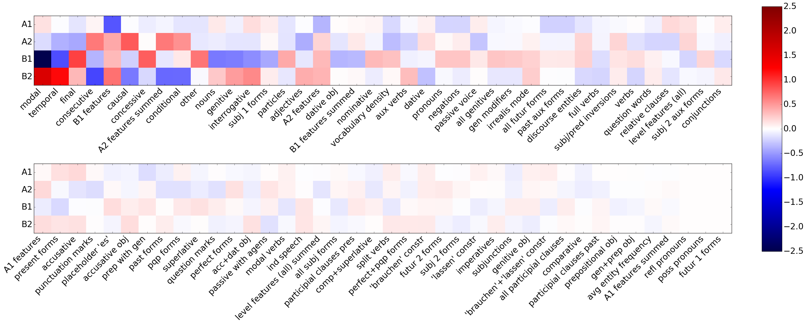

# Language Level Analysis and Classification for German

*lang-level* is a tool for identifying and analyzing linguistic constructions and characteristics that allow inference about the **writer’s language skills**. 

Experiments with a linear support vector classifier trained on these features demonstrate that this approach is **fit for assigning language levels to unseen texts**. 

The first part of the project consisted of the selection of linguistic indicators and patterns that possibly could help in identifying the different language levels. Those features include information about part-of-speech, tempus, mode, use of subjunctive clauses, or passive voice. My tool returns information about the **frequency** of occurrence of these linguistic features and **colors the identified features in the text for visualization**. Both numeric information and the colored text may help in manually evaluating the language level of a given text.

In the second part of the project, I collected a small corpus of text samples for levels A1 to B2. I extracted the previously designed features and used them to train a linear support vector **classifier for the four different language levels**. This system clearly out-performs the baseline and reaches an accuracy of 89%. Feature agglomeration raises the performance to 96% accuracy.

The features also proved suitable for author classification on literary works. For more information, please consult the [reports](04_Reports)).

### Requirements

The system was implemented in Python 3.7 and Jupyter Notebook 6.0.0 and and tested under Ubuntu Linux, but it should work under other environments which have the Python 3 installed (no guarantee). The text collection provides pre-parsed versions for both the language level and literary work datasets so you do not need to install the parser. For full functionality, however, please install ParZu and CorZu and adjust the path in the config file. 

- [ParZu](https://github.com/rsennrich/ParZu)
- [CorZu](https://github.com/dtuggener/CorZu)

Alternatively, you can use another dependency parser for German with CoNLL output format and enter its parsing output instead of raw text.

### Datasets

The folder _01_Text_collections_ contains two datasets: the language level set and the literary work set. The language level set consists of 264 texts for German language learners for levels A1 to B2. They were extracted manually from the web. Please look up the source websites in the [report]([4_Report](4_Reports)/REPORT_JS_Language_Level_Analysis_and_Classification.pdf).

The literary work set contains text samples with a length of 50 sentences each for 20 different authors, with a total of 7365 samples. The texts were extracted from Project Gutenberg.

### How to Run

If you are using ParZu and CorZu, please correct the path in `config.py` .

#### Feature Extraction and Modification

The folder _03_Text_features_ already contains all the features used for the experiments described in the reports. If you want to run the feature extraction again, select version and output directory in the script _RUN_feature_extraction.py_ and execute with Python 3.

If you want to adjust or add language level features, make changes in _language_level_feature_extraction.py_. 

#### Visualization

The Jupyter Notebook _Feature_Visualization.ipynb_ presents a simple visualization tool for coloring specific linguistic characteristics in any given German text. 

#### 

#### Classifier Training and Testing

The Jupyter notebooks _Language_Level_Classification.ipynb_ and  _Language_Level_Classification_Feature_Agglomeration.ipynb_  demonstrate how to use the 80 extracted features for training a classifier. They also show how to identify sparse and less relevant features and how to use feature agglomeration for merging similar features in order to reduce the feature space. 

### Contact

If you have any questions, please do not hesitate to contact me by [email](https://user-images.githubusercontent.com/42718928/60554359-d4f49080-9cfc-11e9-92c9-e81852790ff8.png). 